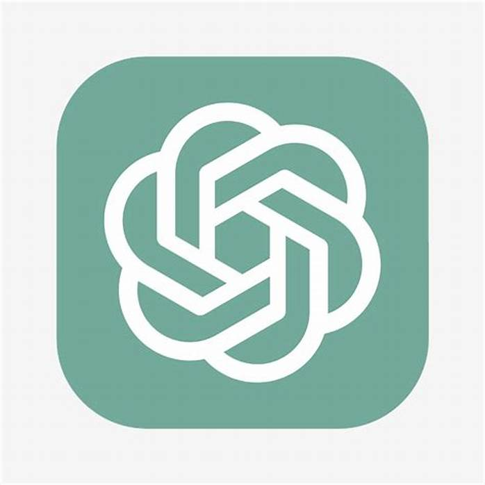
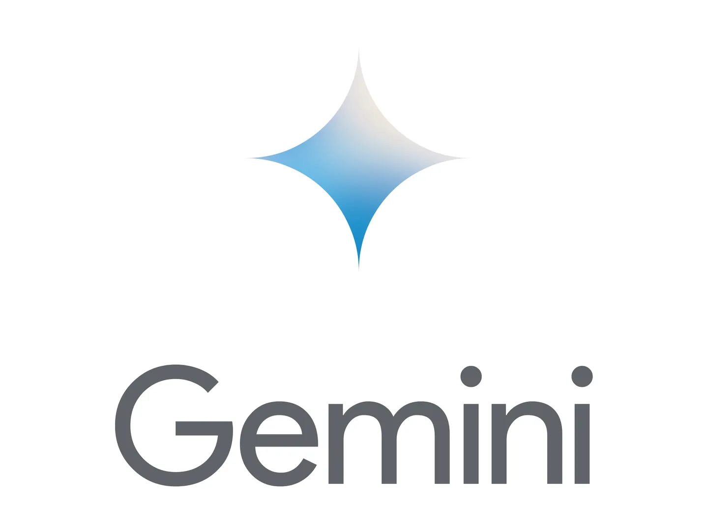

[简体中文](README_zh.md)| English

## **Introduction**

LinkMind is a solution carefully developed by Beijing Liandong North Technology Co., Ltd. to address the significant gap between the rapid development of open source big model technology and its actual application in enterprises. It is an enterprise-level composite multimodal big model middleware that aims to bridge this gap and enable enterprises to customize and deploy big models in a low-cost and efficient manner by providing a secure and professional platform.

Supports but is not limited to the following models:

<div style="display: flex; flex-wrap: wrap; justify-content: flex-start; align-items: center;">
    <div style="display: flex; align-items: center; margin: 10px;">
        
        <span style="font-size: 12px;width: 70px; text-align: left;">Landing&nbsp;&nbsp;&nbsp;&nbsp;&nbsp;&nbsp;&nbsp;&nbsp;</span>
        
        <span style="font-size: 12px;width: 70px; text-align: left;">Vicuna&nbsp;&nbsp;&nbsp;&nbsp;&nbsp;&nbsp;&nbsp;&nbsp;&nbsp;&nbsp;</span>
        
        <span style="font-size: 12px;width: 70px; text-align: left;">ChatGPT&nbsp;&nbsp;&nbsp;&nbsp;&nbsp;&nbsp;</span>
        
        <span style="font-size: 12px;width: 70px; text-align: left;">GPTAzure&nbsp;&nbsp;&nbsp;&nbsp;</span>
        
        <span style="font-size: 12px;width: 70px; text-align: left;">Gemini&nbsp;&nbsp;&nbsp;&nbsp;&nbsp;&nbsp;&nbsp;</span>
        
        <span style="font-size: 12px;width: 70px; text-align: left;">Qwen&nbsp;&nbsp;&nbsp;&nbsp;&nbsp;&nbsp;&nbsp;&nbsp;&nbsp;&nbsp;</span>
    </div>
	</br>
 <div style="display: flex; align-items: center; margin: 10px;">
        
        <span style="font-size: 12px;width: 70px; text-align: left;">Baidu&nbsp;Ernie &nbsp;&nbsp; </span>
        
        <span style="font-size: 12px;width: 70px; text-align: left;">ChatGLM&nbsp;&nbsp;&nbsp;&nbsp;&nbsp;&nbsp;</span>
        
        <span style="font-size: 12px;width: 70px; text-align: left;">Moonshot&nbsp;AI&nbsp;</span>
        
        <span style="font-size: 12px;width: 70px; text-align:   left;">Baichuan&nbsp;&nbsp;&nbsp;&nbsp;&nbsp;</span>
        
        <span style="font-size: 12px;width: 70px; text-align: left;">IFLYTEK&nbsp;&nbsp;&nbsp;&nbsp;&nbsp;&nbsp;</span>
        
        <span style="font-size: 12px;width: 70px; text-align: left;">SenseChat&nbsp;&nbsp;&nbsp;</span>
    </div>
		</br>
    <div style="display: flex; align-items: center; margin: 10px;">
        
        <span style="font-size: 12px;width: 70px; text-align: left;">Doubao&nbsp;&nbsp;&nbsp;&nbsp;&nbsp;&nbsp;&nbsp;&nbsp</span>
        
        <span style="font-size: 12px;width: 70px; text-align: left;">DeepSeek&nbsp;&nbsp;&nbsp;&nbsp;&nbsp;&nbsp;</span>
        
        <span style="font-size: 12px;width: 70px; text-align: left;">Claude&nbsp;&nbsp;&nbsp;&nbsp;&nbsp;&nbsp;&nbsp;&nbsp;</span>
        
        <span style="font-size: 12px;width: 70px; text-align: left;">MiniMax&nbsp;&nbsp;&nbsp;&nbsp;&nbsp;&nbsp;&nbsp;</span>
    </div>
	</br>
</div>


Supports but is not limited to the following intelligent agent platforms:

<div style="display: flex; flex-wrap: wrap; justify-content: flex-start; align-items: center;">
    <div style="display: flex; align-items: center; margin: 10px;">
        
        <span style="font-size: 12px;"> Hunyuan&nbsp;&nbsp;&nbsp;&nbsp; </span>
        
        <span style="font-size: 12px;"> Coze &nbsp;&nbsp;&nbsp;&nbsp;</span>
        
        <span style="font-size: 12px;">Wenxin &nbsp;&nbsp;&nbsp;&nbsp;</span>
        
        <span style="font-size: 12px;">Zhipu &nbsp;&nbsp;&nbsp;&nbsp;</span>
    </div>
</div>

  </br>
The following database types are supported but not limited to:
  </br>
<div style="display: flex; flex-wrap: wrap; justify-content: flex-start;">
    <div style="display: flex; align-items: center; margin: 10px;">
        
        <span style="font-size: 12px;">Chroma&nbsp;&nbsp;&nbsp;</span>
        
        <span style="font-size: 12px;">elastic&nbsp;&nbsp;&nbsp;</span>
        
        <span style="font-size: 12px;">mysql&nbsp;&nbsp;&nbsp;</span>
    </div>
</div>

## Product Features
This product provides efficient, stable and easy-to-use functions through a series of advanced technologies and optimized designs to meet diverse user needs. The following are the main features:

**More accurate retrieval enhancement (RAG)**

Through refined data management and optimization algorithms, ensure high accuracy of model output.

Support continuous model learning and gradually improve overall performance and response accuracy.

**Faster pre-read cache (Medusa)**

Introducing Medusa technology, effectively reducing user waiting time through pre-read cache mechanism.

Optimize data processing flow to further improve model operation efficiency.

**More efficient model performance improvement**

Adopt advanced performance optimization strategies to significantly improve the computing efficiency and response speed of the model.

Maintain high performance in a variety of application scenarios to meet complex task requirements.

**More stable automatic switching of large models**

Support multi-link backup mechanism to ensure that the system can seamlessly switch to the backup model when a failure occurs.

Provide a stable operating environment to reduce the risk of service interruption caused by technical failures.

**More powerful intent detection (Graph)**

Use knowledge graph technology to accurately identify user intent and provide targeted responses.

Quickly analyze user input to ensure accurate, stable and easy-to-use responses.

**More convenient one-time writing for multiple models**

Supports one-time writing to adapt to multiple models, significantly reducing duplication of work in development.

Reduces development and maintenance difficulties and improves overall development efficiency.
## Online Demo

To allow users to intuitively experience the powerful functionality and convenience of LinkMind, we offer an online demo. You can visit and experience it through the following link: [https://lagi.landingbj.com](https://lagi.landingbj.com/).

## Quick Start

For developers, we provide a simple way to compile and run the LinkMind application. You can choose to use the Maven command-line tool to package, or run it through mainstream Integrated Development Environments (IDEs) like IntelliJ IDEA. Please make sure you are using JDK version 8 or above.

### Method 1: Using Maven

First, you need to clone the LinkMind project repository and switch to the project directory:

```shell
git clone https://github.com/landingbj/lagi.git
cd lagi
```

Next, modify the [`src/main/resources/lagi.yml`](lagi-web/src/main/resources/lagi.yml) configuration file, replace the large language model API_KEY or SECRET_KEY with your own keys, and set the `enable` field of the model you wish to activate to `true` as needed. Detailed configuration methods can be seen in the [configuration documentation](docs/config_en.md).

```yaml
- name: gpt-test
  type: GPT
  enable: true
  priority: 1
  model: gpt-3.5-turbo-1106
  api_key: your-apikey
```

Then, use the Maven command to package the project, and the packaged war file will be generated in the `target` directory:

```shell
mvn package
```

Finally, deploy the generated war package to the Tomcat server. After starting Tomcat, you can view the specific page of LinkMind by accessing the corresponding port through a browser.

### Method 2: Using IDE

If you prefer to use an IDE for development, you can directly open the LinkMind project with mainstream IDEs like IntelliJ IDEA. After publishing the project as a web project to the Tomcat server, you can view the interface of LinkMind by accessing the respective port through a browser.

### Method 3: Docker

- Image Name: landingbj/lagi

- Pull Command: 

  ```bash
  docker pull landingbj/lagi
  ```

- Start Container Command: 

  ```bash
  docker run -d --name lagi-web -p 8080:8080 landingbj/lagi
  ```

## Tutorial

To help you efficiently become familiar with and utilize LinkMind, we have prepared a comprehensive set of  [Tutorial presentations](docs/tutor_en.md). Through this tutorial, whether you are a beginner or an experienced developer, you can quickly get started. The tutorial also covers the setup of the LinkMind basic environmental vector database, guiding you step by step from the download, installation, and configuration of LinkMind, to actual operation, allowing you to easily start learning and quickly master the operational skills of LinkMind.

## API

The LinkMind project also provides multiple RESTful API interfaces, facilitating users to integrate AI services into their own applications. We have prepared detailed [API documentation](docs/API_en.md) for developers, which you can refer to understand how to use these APIs to enrich your application features.

## Integration

In order to help you better understand and use LinkMind, we provide you with detailed [Guide documentation](docs/guide_en.md). You can refer to this document to understand the structure and content of the project, so that you can quickly invoke relevant features and develop large model applications efficiently. It helps you understand and use a variety of AI features provided in the project. With this guide, you can easily integrate AI features such as text conversation, speech recognition, text-to-speech, and image generation into your applications, achieving a more intelligent and user-friendly interaction experience.

If you wish to integrate LinkMind into your project, you can refer to our [Integration documentation](https://github.com/landingbj/lagi/blob/main/docs/guide_en.md#quick-integrate-into-your-existing-project). This document will guide you through the process of seamlessly integrating LinkMind into your project. In addition, we provide frequently asked questions and best practices to help you avoid common pitfalls during integration, ensuring a smooth progress of your project. It covers comprehensive guidance from setting up the environment to implementing features. Whether you are a beginner or an experienced developer, you will be able to quickly integrate LinkMind into your project.

## Extension

If you are not satisfied with the adapted large model for LinkMind, you can also refer to our [Extension documentation](docs/extend_en.md) to extend LinkMind, adapting it to your preferred large model. This document not only covers the methods for adapting and extending functional models and vector databases but also provides expansion examples to help you quickly grasp the methods for extending LinkMind, meeting your specific requirements.

If you find the vector databases currently integrated with LinkMind to be less than satisfactory for your needs, you can also refer to our [Extension documentation](https://github.com/landingbj/lagi/blob/main/docs/extend_en.md#Database-Extension) to expand LinkMind and adapt it to your preferred vector database. This will meet your diverse business requirements, enhance the overall performance and reliability of your system, and provide a more enriching and efficient data management experience.

## Security

In order to better integrate LinkMind into your business, you can add the keywords you need to filter in the [sensitive_word.json](lagi-web/src/main/resources/sensitive_word.json) file, specify the priority keywords in the [priority_word.json](lagi-web/src/main/resources/priority_word.json) file, and set the stopping keywords in the [stopping_word.json](lagi-web/src/main/resources/stopping_word.json) file to change the return results of the conversation, guide the conversation in a specific direction, and automatically stop the conversation when needed.

Example: 

Set the sensitive word filter, level has three values, 1: delete the entire sentence when the sensitive word is matched 2: replace with mask 3: erase (default). mask: mask string (default :...) . rules: represents a list of sensitive rules, where rule for each list element represents the regular expression matching the sensitive word, mask and level are used globally if not specified:   

If `OPENAI` is successfully matched, the `OPENAI` is erased. If `hello` is successfully matched, the `hello` is replaced with `***`. If `people` is successfully matched, use `...` Substitution.

```json
{
  "mask": "...",
  "level": 3,
  "rules": [
    {"rule":"OPENAI"},
    {"rule":"hello", "level": 2, "mask": "***"},
    {"rule":"people", "level": 2}
  ]
}
```

Example：Set priority keywords and stop keywords:

```json
[
  "openai"
]
```

## Downloads

Thank you for your support of LinkMind ! To help you get started quickly and easily, we have provided a pre-packaged LinkMind application that is ready for immediate use.

- **Jar File**: The core dependency library of LinkMind.
  - File Name: lagi-core-1.0.6-jar-with-dependencies.jar
  - Download Link: [Click here to download](https://downloads.landingbj.com/lagi/lagi-core-1.0.6-jar-with-dependencies.jar)

- **War File**: The Web application of LinkMind, which can be directly deployed to a web container.
  - File Name: lagi-web.war
  - Download Link: [Click here to download](https://downloads.landingbj.com/lagi/lagi-web.war)
