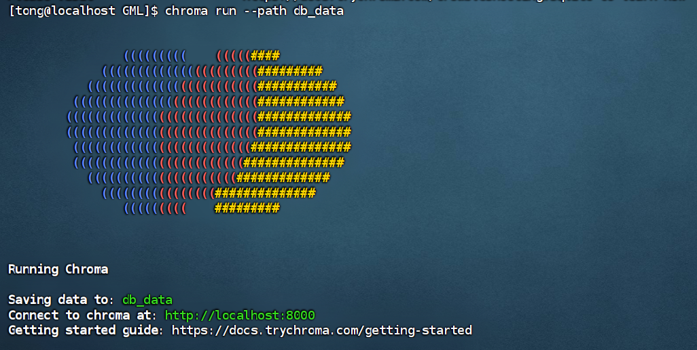
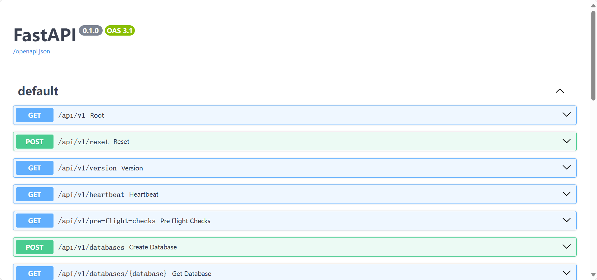
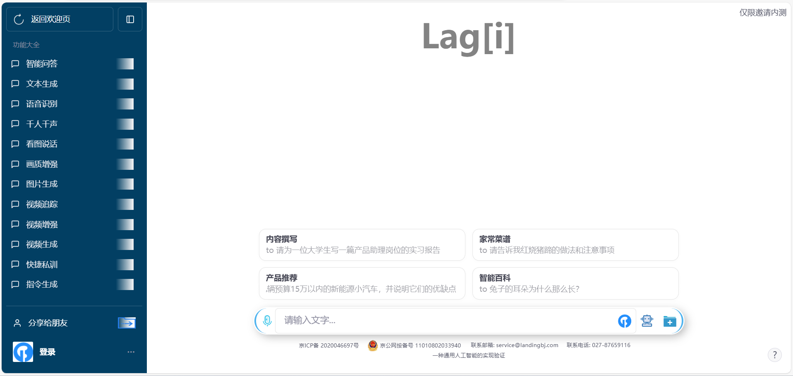
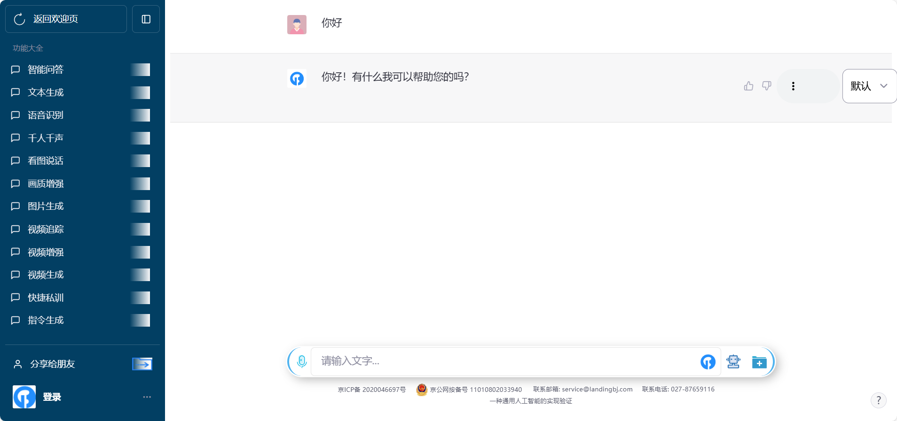
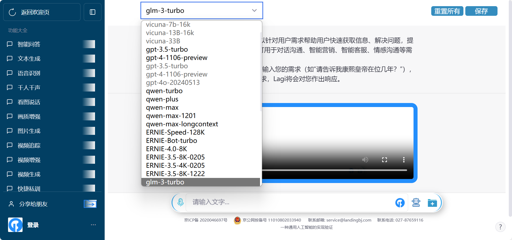
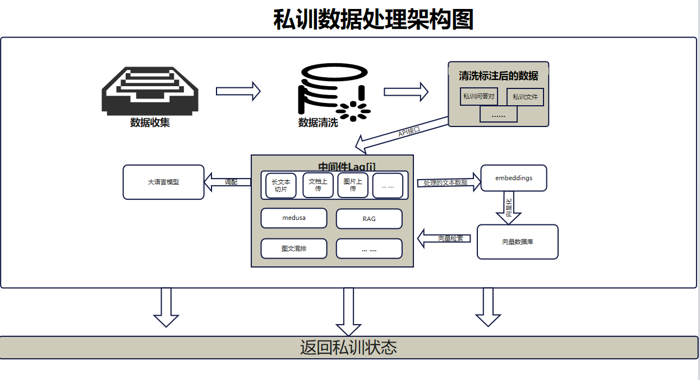
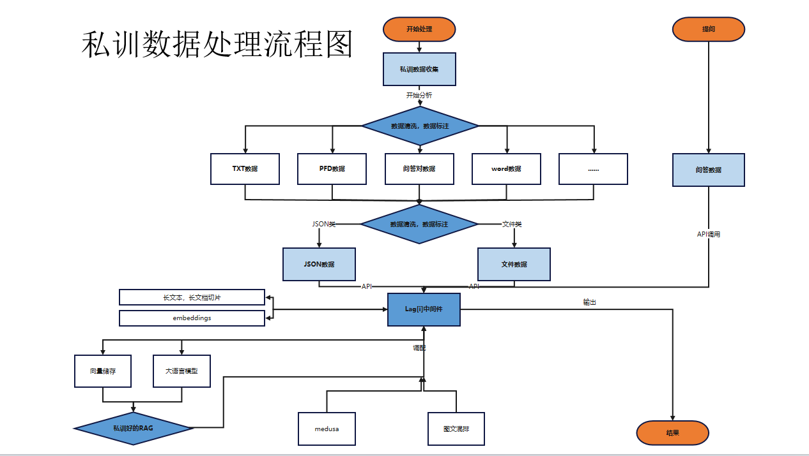

# 教学演示

LinkMind(联智) 是一款强大的企业级多模态大模型中间件，它可以帮助您轻松地将大模型技术集成到您的业务中。本教程将引导您从零开始，完成 LinkMind(联智) 的下载、安装、配置与运行，让您快速掌握 LinkMind(联智) 的使用方法。

## 环境准备

在开始之前，请确保您已经准备好以下环境：

* **Java 8 或更高版本**
* **Maven(tomcat版本不能低于兼容的idk的最低版本，如果你的 JDK版本只是1.8，那么Tomcat版本必须在10.0.x以下)**
* **Docker (可选，用于运行向量数据库)**

## 1. 下载 LinkMind(联智)

对于开发者而言，我们提供了简便的方法来编译和运行LinkMind(联智) 应用。您可以选择使用maven命令行工具进行封包，或者通过IntelliJ IDEA等主流的集成开发环境（IDE）进行运行。

### 方法一：使用IDE+maven打包

1. **克隆项目**：

**打开 GitHub 仓库**：在 IDE 中连接 LinkMind(联智) 的 GitHub 仓库，使用 IDE 的克隆功能，将 LinkMind(联智) 项目克隆到本地。

|       | GitHub 仓库                           |
| ----- | ------------------------------------- |
| SSH   | git@github.com:landingbj/lagi.git     |
| HTTPS | https://github.com/landingbj/lagi.git |
```shell
git clone https://github.com/landingbj/lagi.git
```
2. **进入项目**：切换到项目目录：

```shell
cd lagi
```

3. **编译项目**：在项目根目录下运行 Maven 命令进行编译：

```bash
mvn clean install
```

4. **选择 IDE**： 您可以选择使用 IntelliJ IDEA 或 Eclipse 等主流 IDE。

5. **编译项目**： 使用 IDE 的编译功能，编译 LinkMind(联智) 项目。

### 方法二：使用 Web 容器(Tomcat)

安装tomcat之前要先安装jdk1.8;查看相关版本

若没有安装idk1.8，请参考注1，安装idk1.8后再进行下一步

若没有安装Tomcat，请参考注2，安装Tomcat后再进行下一步


1. **下载War 文件**：LinkMind(联智)的Web应用，可直接部署到Web容器。
   - 文件名：`lagi-web.war`
   - 下载链接：[点击这里下载](https://downloads.landingbj.com/lagi/lagi-web.war)

2. **启动项目**：
* 将下好的war包文件放入解压好的Tomcat的webapps路径下，如：

```bash
apache-tomcat-8.5.99\webapps\
```

* 如果本地未安装elastic和chroma，则修改apache-tomcat-8.5.99\webapps\ROOT\WEB-INF\classes\lagi.yml中对应配置项为enable: false

```yml
  term:
    # This  is an adapter for Elasticsearch, providing search and analytics capabilities on large datasets.
    - name: elastic
      driver: ai.bigdata.impl.ElasticSearchAdapter
      host: localhost
      port: 9200
      enable: false

  rag: # RAG enhances large language models by integrating external knowledge retrieval.
    vector: chroma
    term: elastic
    graph: landing
    enable: false
    priority: 10
    default: "Please give prompt more precisely"
    track: true
```

* 打开执行文件‘startup.bat’，如：

```bash
apache-tomcat-8.5.99\bin\startup.bat
```

可以通过浏览器访问：http://localhost:8000/查看是否启动成功

### 方法三：Docker 

- 镜像名称：`landingbj/lagi`

- 拉取命令：

  ```bash
  docker pull landingbj/lagi
  ```

- 启动容器：

  ```bash
  docker run -d --name lagi-web -p 8080:8080 landingbj/lagi
  ```


## 2. 安装向量数据库

LinkMind(联智) 支持多种向量数据库，例如 ChromaDB。如果您想使用检索增强 RAG 功能，需要安装向量数据库。

**以 ChromaDB 为例**:

***确保已安装 Python 运行环境（下载资源在文档最后注3）*** 

- 安装ChromaDB(命令执行都是在黑窗口执行)

```bash
pip install chromadb
```

- 创建数据库存储目录 'db_data'

```bash
mkdir db_data
```

- 启动数据库服务( 'db_data'是上一步中创建的文件夹名)

```bash
# --path参数可以指定数据持久化路径
# 默认开启8000端口
chroma run --path db_data
```

**注意：**

在导入 chromadb 包时报错，原因是sqlite3版本太低

> RuntimeError: Your system has an unsupported version of sqlite3. Chroma requires sqlite3 >= 3.35.0.

请按以下步骤操作

1. 安装pysqlite3-binary

```bash
pip install pysqlite3-binary
```

2. 导入 chromadb 包时，覆盖原sqlite3 库 找到你的chromadb源码编辑`__init__.py`文件

```bash
vim xxx/chromadb/__init__.py
```

3. 在开头添加3行代码

```text
__import__('pysqlite3')
import sys
sys.modules['sqlite3'] = sys.modules.pop('pysqlite3')
```

4. 启动数据库服务
   

安装完成，您可以通过浏览器访问：http://localhost:8000/docs 查看是否启动成功。


## 3. 配置文件

修改`lagi.yml`配置文件，选择您喜欢的模型，将其中的模型的`your-api-key`等信息替换为您自己的密钥，并根据需求将启用的模型的`enable`字段设置为`true`。

***以配置kimi为例：***

如是以Tomcat形式启动，修改路径为：apache-tomcat-8.5.99\webapps\ROOT\WEB-INF\classes\lagi.yml

- 填入模型信息并开启模型,修改enable设置为true。
  
  ```yaml
  - name: kimi
    type: Moonshot
    enable: true
    model: moonshot-v1-8k,moonshot-v1-32k,moonshot-v1-128k
    driver: ai.llm.adapter.impl.MoonshotAdapter
    api_key: your-api-key  
  ```

- 根据您的需求，设置模型输出的方式stream和优先级priority，值越大优先级越高。
  
  ```yaml
  chat:
      - backend: doubao
        model: doubao-pro-4k
        enable: true
        stream: true
        priority: 160
  
      - backend: kimi
        model: moonshot-v1-8k
        enable: true
        stream: true
        priority: 150
  ```

- 根据您的需求，添加route修改。
  
  ```yaml
  # 规则：(小信智能体&股票智能体&汇率智能体) # A|B -> 轮询，A 或 B，表示在 A 和 B 之间随机轮询；
  # A,B -> 故障转移，先执行 A，如果 A 失败，再执行 B；
  # A&B -> 并行，同时调用 A 和 B，选择合适的唯一结果；
  # 该规则可以组合成 ((A&B&C),(E|F))，表示先同时调用 ABC，如果失败，则随机调用 E 或 F。
    chat:
      route: best((landing&chatgpt),(kimi|ernie))
  ```

选择配置的向量数据库，并填入对应的配置信息。

***以配置本地Chroma为例：***

- 替换url地址为Chroma的url地址http://localhost:8000。
  
  ```yaml
  vectors:
      - name: chroma
        driver: ai.vector.impl.ChromaVectorStore
        default_category: default
        similarity_top_k: 10
        similarity_cutoff: 0.5
        parent_depth: 1
        child_depth: 1
        url: http://localhost:8000
  
  rag:
      vector: chroma
      # fulltext: elasticsearch
      graph: landing
      enable: true
      priority: 10
      default: "Please give prompt more precisely"
  ```

## 4. 引入依赖

调用LinkMind(联智) 相关API接口需引入依赖，您可以通过maven引入或直接导入jar的方式。

***以maven引入为例：***

- 使用maven下载依赖执行命令。
  
  ```shell
  mvn clean install
  ```

## 5. 启动web服务。

您可以选择使用maven命令行工具进行封包，或者通过IntelliJ IDEA等主流的集成开发环境（IDE）进行运行。

***以maven命令行工具封包为例：***

1. 使用maven命令进行项目封包，封包完成后将会在`target`目录下生成一个war文件。

```shell
mvn package
```

2. 部署到 Web 服务器: 将打包后的文件部署到 Web 服务器中。  

将生成的war包部署到Tomcat服务器中。启动Tomcat后，通过浏览器访问对应的端口，即可查看LinkMind(联智) 的具体页面。

例如：本地8080端口：http://localhost:8080/

本地访问：


## 6. 测试 LinkMind(联智)

使用浏览器访问 LinkMind(联智) 页面，您可以使用提供的示例代码或 API 接口进行测试，例如文本对话、语音识别、文字转语音、图片生成等功能。

文本对话：


## 7. 模型切换

LinkMind(联智) 提供了动态切换模型的功能，您可以在配置文件中设置多个模型，并根据需求选择不同的模型进行切换。

修改配置切换模型：通过修改`lagi.yml`配置文件，将需要使用的模型设置为`enable`为`true`。在非流式调用下当前服务宕机，会根据`priority`值自动启用其他模型。


```shell
- backend: chatglm
  model: glm-3-turbo
  enable: true
  stream: true
  priority: 10

- backend: ernie
  model: ERNIE-Speed-128K
  enable: false
  stream: true
  priority: 10
```
- 根据您的需求，同时添加route的修改。
  
  ```yaml
  # 规则：(小信智能体&股票智能体&汇率智能体) # A|B -> 轮询，A 或 B，表示在 A 和 B 之间随机轮询；
  # A,B -> 故障转移，先执行 A，如果 A 失败，再执行 B；
  # A&B -> 并行，同时调用 A 和 B，选择合适的唯一结果；
  # 该规则可以组合成 ((A&B&C),(E|F))，表示先同时调用 ABC，如果失败，则随机调用 E 或 F。
    chat:
      route: best((landing&chatgpt),(kimi|ernie))
  ```

在线切换模型，选择您喜欢的模型。


## 8. 自由扩展

如果您对 LinkMind(联智) 已适配的大模型或向量数据库不满意，您可以参考[扩展文档](extend_zh.md)，对 LinkMind(联智) 进行扩展，适配您喜欢的大模型或向量数据库。

## 9. 私训问答对

您可以通过上传问答对的形式，将内部数据信息集成至LinkMind(联智)，从而定制训练一个专属的大模型。模型训练过程中`distance`代表您的问题与上传的问答对之间的距离，该值越小，说明您的问题与上传的问答对越相似度越高。如果模型识别的最匹配问答对与您问题的实际意图不符，您可以采取问答对的新增，删除来进一步优化模型的性能。通过不断地调整和优化您的问答对数据，您可以逐步提高模型对您问题的理解能力，从而提高系统的准确性。

上传私训问答的接口可以参考[接口文档][API_zh.md]中的私训问答对数据的API。

### **私训数据处理架构图**



### **私训数据处理流程图**




### 私训问答优化

您可以通过提高数据质量，优化问答对匹配，调整超参数，持续监控和更新等方法来提高模型对您问题的理解能力，从而提高系统的准确性。

1. **提高数据质量**
  
   数据清洗：确保训练数据集的质量，通过去除无效、错误或重复的数据，提高数据的准确性。
   
   数据预处理：对文本进行标准化、词干化（stemming）或词形还原（lemmatization），提高问题的多样性和代表性，确保问题覆盖不同的场景和语境，从而提高模型的泛化能力。

2. **问答对匹配**
  
   增加相关性：确保问题与答案之间的相关性，避免无关或低质量的问答对，可以根据向量距离对相关问题数据进行新增或删除。
   
   调节数据平衡：平衡不同类别的问题和答案，避免某个类别的问题或答案过于集中，对相关问题数据进行新增或删除。

3. **调整超参数**
  
   调整超参数：通过调整模型的超参数,来提升模型的性能和稳定性。
   超参数temperature，当它接近0时，模型的输出分布变得更加集中，模型倾向于选择概率最高的输出，使生成的文本或决策更加确定和可预测。当temperature接近无穷大时，模型的输出分布变得更加均匀更加多样和随机。
   
   迭代训练：通过多次迭代训练，逐步优化模型性能。
   
4. **持续监控和更新**
  
   持续监控和更新：定期监控模型在实际应用中的表现，及时更新模型或训练数据，以解决数据失效的问题。

## 10. 生成指令集

生成指令集功能可以参考[接口文档](API_zh.md)中的生成指令集的API。

提取问答对的依据：

1. **结构化抽取**：从文档中提取问题和对应的答案，并将其整理为清晰的问答形式。
2. **语言总结能力**：根据原文内容，提取关键信息并生成简明的回答，确保准确表达语义。
3. **格式化处理**：将问答内容转化为指定格式的 JSON 对象，以便用于进一步的训练或分析。
4. **逻辑划分**：根据文档内容的段落主题（如背景介绍、应用场景、具体优势等），生成具有明确边界的问题和答案。

## 11. 上传私训学习文件

上传私训学习文件的功能详细介绍如下，具体API调用可参考[接口文档](API_zh.md)中的“上传私训学习文件”的API。

### 支持的文件格式

该功能支持以下文件格式：
- 文本格式：txt、doc、docx、pdf
- 表格格式：xls、xlsx、csv
- 图片格式：jpeg、png、jpg、webp
- 演示文稿：ppt、pptx

### 文件处理方式

针对不同类型的文件，LinkMind将采取差异化处理策略，自动高效地将文件内容转换为大模型训练的理想格式，以提高模型的学习效率和性能，帮助用户训练出属于自己的专属大模型。具体分类处理方式如下：

1. **问答类文件处理**：
   - 对于问答文件，LinkMind将运用智能算法分析内容，精确提炼关键词，并有效分离问题与答案，以提高模型的学习效率和性能。

2. **章节类文件处理**：
   - 针对具有章节结构的文件，LinkMind会优先剔除目录等非内容性元素，再运用智能算法分析内容，从而进行精准的段落划分，确保段落完整，便于模型学习与处理。

3. **表格类文件处理**：
   - 在处理普通表格文件时，LinkMind会识别表头的位置与布局，将内容转换为Markdown格式，以优化模型的学习与处理。

4. **表格纯数字类文件处理**：
   - 对于纯数字表格文件，LinkMind将根据表格中数字类型数据含量，结合Text2Sql技术，提供最佳表格切片方案，将表格内容自动转为结构化类型数据，导入MySQL数据库中，结合Sql2Text技术实现智能问数。若未配置MySQL，则按“表格类文件处理”流程处理。

5. **图文类文件处理**：
   - 对于文档中包含图文信息的文件，LinkMind将结合图文混排技术，精准提取文档中的图片和内容，从而辅助大模型对该文件的学习与处理。若未配置图文混排，将按普通文件处理流程操作。

6. **标题类文件处理**：
   - 文件中的标题将被独立提取，作为关键信息单元进行专项处理。精准识别标题，确保其作为内容的核心元素得以有效提取，为大模型提供高质量的学习数据。

7. **演示文稿类文件处理**：
   - 对于演示文稿类文件，LinkMind将读取每页文稿内容，将该页文本内容与图片进行关联，以便提升大模型对文稿的学习与处理能力。

8. **图片类文件处理**：
   - 在处理图片文件时，LinkMind将结合OCR技术进行图文识别，并将识别信息与图片关联，作为关键信息单元。若OCR未配置，将默认使用图片名称与图片关联处理。

## 总结

通过本教程，您已经成功地将 LinkMind(联智) 集成到您的项目中，并可以开始使用 LinkMind(联智) 提供的各种 AI 功能。LinkMind(联智) 的强大功能和灵活的扩展性可以帮助您轻松地将大模型技术应用到您的业务中，提升用户体验和效率。


**注1**：安装idk1.8教程

1. **下载并安装jdk1.8**：jdk1.8下载地址：https://www.oracle.com/technetwork/java/javase/downloads/jdk8-downloads-2133151.html

2. **配置jdk环境变量**：
搜索‘编辑系统环境变量’进入系统环境变量，为jdk添加相应的环境变量。
* 添加JAVA_HOME变量：点击新建，在弹出的新建对话框中，添加以下内容：
变量名：JAVA_HOME
变量值：C:\Program Files\java\jdk
* 添加CLASSPATH变量：点击新建，在弹出的新建对话框中，添加以下内容：
变量名：CLASSPATH
变量值：.;%JAVA_HOME%\lib\dt.jar;%JAVA_HOME%\lib\tools.jar
* 更改Path变量：点击编辑，在弹出的新建对话框中点击新建，添加%JAVA_HOME%\bin;%JAVA_HOME%\jre\bin。
* 测试jdk是否配置完成，win+R打开黑窗口，输入cmd
通过java -version命令，查看java版本，显示jdk版本号则为安装配置完成
```bash
java -version
```
**注2**：安装Tomcat教程

**下载Tomcat**： Tomcat下载地址：https://archive.apache.org/dist/tomcat/tomcat-8/v8.5.99/bin/apache-tomcat-8.5.99.zip

**注3**：安装Python教程

**下载Python **：Python 官网：https://www.python.org/